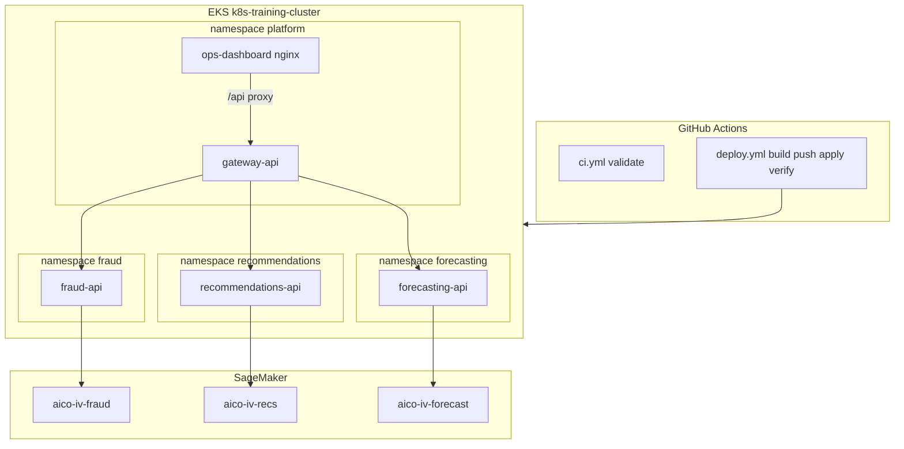

# Assessment IV — Internal ML Platform

Private working repo for Code Platoon **Assessment IV**: an internal ops surface that runs three team ML services on the class EKS cluster, each backed by a SageMaker endpoint, with CI/CD, a gateway, and a React dashboard.

| | |
|---|---|
| **Scenario** | Scenario 1 — ML Platform (Fraud / Recommendations / Forecasting) |
| **AWS account** | `388691194728` (`codeplatoon` profile), region `us-east-1` |
| **EKS cluster** | `k8s-training-cluster` (class-shared — we do **not** create or destroy it) |
| **Upstream brief** | [codeplatoon-devops/aico-assessment-iv](https://github.com/codeplatoon-devops/aico-assessment-iv) |
| **Rubric / scenarios** | [docs/assessment-brief.md](docs/assessment-brief.md) |
| **Build log** | [History.md](History.md) |
| **Agent notes** | [agent.md](agent.md) |

---

## Architecture



**Naming:** Kubernetes namespaces are `fraud` / `recommendations` / `forecasting` / `platform`.  
`aico-iv-*` names are **SageMaker endpoints** (ConfigMap `ENDPOINT_NAME`), not namespaces.

| Namespace | Deployment | Image | SageMaker endpoint |
|-----------|------------|-------|--------------------|
| `fraud` | `fraud-api` | `ghcr.io/bigessfour/fraud-detection` | `aico-iv-fraud` |
| `recommendations` | `recommendations-api` | `ghcr.io/bigessfour/recommendations` | `aico-iv-recs` |
| `forecasting` | `forecasting-api` | `ghcr.io/bigessfour/forecasting` | `aico-iv-forecast` |
| `platform` | `gateway-api` | `ghcr.io/bigessfour/gateway` | — (proxies teams) |
| `platform` | `ops-dashboard` | `ghcr.io/bigessfour/ops-dashboard` | — (UI) |

Each team FastAPI exposes `/health`, `/ready`, `/predict`. Gateway exposes aggregate `/health` and `POST /predict/{team}`. A/B is a **ConfigMap weight label** (`WEIGHT_A`), not two SageMaker model variants.

---

## Repository layout

```text
services/
  fraud-detection/      # FastAPI → aico-iv-fraud
  recommendations/      # FastAPI → aico-iv-recs
  forecasting/          # FastAPI → aico-iv-forecast
  gateway/              # single entry point + A/B label
dashboard/              # React ops UI (Tailwind CDN) + nginx /api proxy
k8s/
  fraud|recommendations|forecasting/   # ns, ConfigMap, Deployment, Service, quota
  platform/             # gateway + dashboard
.github/workflows/
  ci.yml                # PR/main: Python syntax + manifest presence
  deploy.yml            # main: matrix build → GHCR → EKS apply → verify
terraform/              # namespaces, ConfigMaps, platform RBAC + remote state
scripts/                # verify.sh, demo-failure.sh, bootstrap-tf-backend.sh
History.md              # issues hit + fixes
getting_started.md      # original upstream bootstrap notes
```

---

## Prerequisites

- AWS CLI + profile `codeplatoon` (`aws sts get-caller-identity` → account `388…`)
- `kubectl`, Docker, Terraform 1.0+, Python 3.9+, Node 18+, `gh`
- GitHub repo secrets (already used by Actions): `AWS_ACCESS_KEY_ID`, `AWS_SECRET_ACCESS_KEY`, `GHCR_TOKEN`

```bash
export AWS_PROFILE=codeplatoon
export AWS_REGION=us-east-1
aws eks update-kubeconfig --region us-east-1 --name k8s-training-cluster
kubectl get nodes
aws sagemaker list-endpoints --region us-east-1
```

Optional local env scaffolding: `./start.sh` (creates gitignored `.env` / `.env.secrets`).

---

## Deploy

### Automated (preferred)

Push to `main` (paths under `services/`, `dashboard/`, `k8s/`, or `deploy.yml`) or run **Actions → Build and Deploy → Run workflow**.

The workflow:

1. Builds/pushes `linux/amd64` images to GHCR (`:latest` and `:${{ github.sha }}`)
2. Creates/updates per-namespace AWS + GHCR pull secrets from Actions secrets
3. Applies manifests (**never** applies `secret.example.yml`)
4. Pins deployments to the commit SHA tag
5. Verifies rollouts, `ENDPOINT_NAME` isolation, and in-cluster `/health` + `/ready`

### Manual (laptop)

```bash
# Example: rebuild one service for amd64 (required from Apple Silicon)
docker build --platform linux/amd64 -t ghcr.io/bigessfour/fraud-detection:latest services/fraud-detection
gh auth token | docker login ghcr.io -u Bigessfour --password-stdin
docker push ghcr.io/bigessfour/fraud-detection:latest

kubectl apply -f k8s/fraud/namespace.yml
# create fraud-aws-creds + ghcr-secret (see History.md / deploy.yml — do not commit values)
kubectl apply -f k8s/fraud/
```

---

## Verify

```bash
# Pods
kubectl get pods -n fraud
kubectl get pods -n recommendations
kubectl get pods -n forecasting
kubectl get pods -n platform

# Routing isolation
kubectl -n fraud exec deploy/fraud-api -- \
  python -c 'import os; print(os.environ["ENDPOINT_NAME"])'          # aico-iv-fraud
kubectl -n recommendations exec deploy/recommendations-api -- \
  python -c 'import os; print(os.environ["ENDPOINT_NAME"])'          # aico-iv-recs
kubectl -n forecasting exec deploy/forecasting-api -- \
  python -c 'import os; print(os.environ["ENDPOINT_NAME"])'          # aico-iv-forecast

# Gateway aggregate health
kubectl -n platform port-forward svc/gateway-api 18080:80
curl -s http://127.0.0.1:18080/health | python3 -m json.tool
curl -s http://127.0.0.1:18080/ready
```

### Ops dashboard

```bash
kubectl -n platform port-forward svc/ops-dashboard 3000:80
# open http://localhost:3000
```

The UI live-polls gateway `/health` (via nginx `/api`), shows owner/version/endpoint, and can `POST /predict/{team}` to prove routing.

---

## Verify + controlled failure demos

```bash
export AWS_PROFILE=codeplatoon
./scripts/verify.sh                 # Deployments, ENDPOINT_NAME isolation, in-cluster /health+/ready
./scripts/demo-failure.sh quota     # ResourceQuota rejects 5th fraud pod; always restores
./scripts/demo-failure.sh ready     # empty ENDPOINT_NAME → Ready=False + /ready 503; always restores
```

Both demos use an EXIT trap to restore replicas and `ENDPOINT_NAME`. Evidence: [History.md](History.md).

---

## Terraform

**Do not** `terraform destroy` the class EKS cluster. This stack only manages **our** namespaces, ConfigMaps, and platform RBAC, plus remote state (S3 + DynamoDB). The cluster is a data source only.

```bash
export AWS_PROFILE=codeplatoon
./scripts/bootstrap-tf-backend.sh   # once per account
cd terraform
terraform init
terraform plan
terraform apply
terraform destroy   # ONLY resources in this state
```

Details and import notes: [terraform/README.md](terraform/README.md).

---

## Teardown (workloads only)

Removes **our** namespaces and apps. Leaves the shared cluster alone.

```bash
kubectl delete namespace fraud recommendations forecasting platform --wait=false
# Optional: delete GHCR packages / SageMaker endpoints only if you own them and instructors allow
```

Preferred teardown when Terraform state is initialized:

```bash
cd terraform && terraform destroy
```

---

## Local FastAPI smoke (optional)

```bash
cd "/path/to/Assessment 4"
source .venv/bin/activate   # or: python3 -m venv .venv && pip install -r services/fraud-detection/requirements.txt
export ENDPOINT_NAME=aico-iv-fraud AWS_REGION=us-east-1 AWS_PROFILE=codeplatoon
uvicorn app:app --app-dir services/fraud-detection --port 8000
# other terminal:
curl http://localhost:8000/health
curl http://localhost:8000/ready
```

If `/ready` fails with a CRT / login-credential message after `aws login`, prefer `AWS_PROFILE=codeplatoon` (Keychain) or install `botocore[crt]` inside the venv. See [History.md](History.md).

---

## Presentation notes

- **A/B:** gateway ConfigMap `WEIGHT_A` labels responses with `variant` A/B. It does **not** deploy two SageMaker model versions.
- **Images:** always build `--platform linux/amd64` from Apple Silicon.
- **Auth for long sessions:** use `AWS_PROFILE=codeplatoon`; `aws login` sessions expire mid-deploy.
- Failures and fixes for the write-up: [History.md](History.md).
